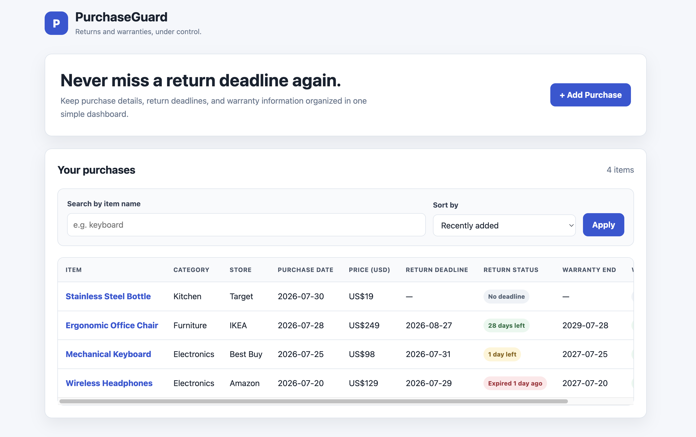
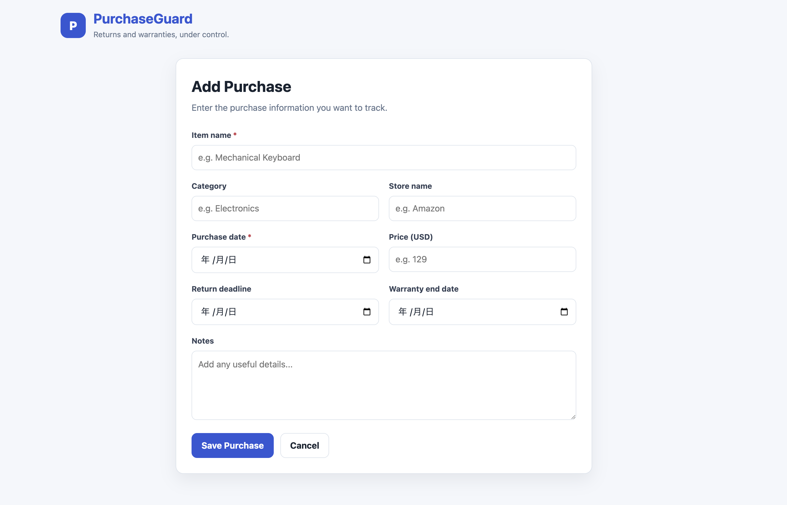
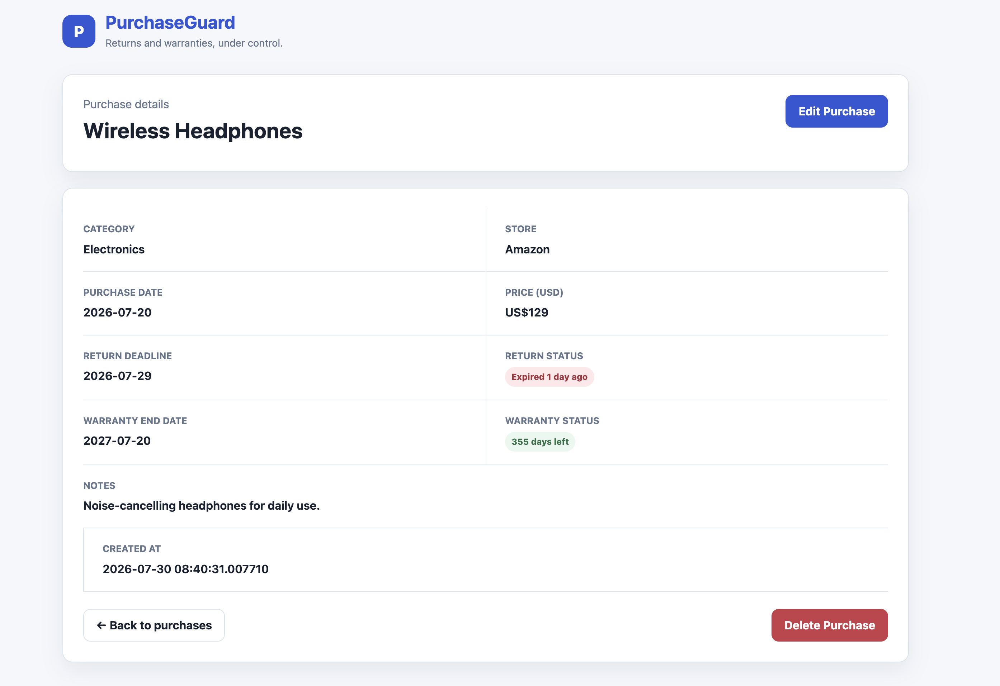

# PurchaseGuard

PurchaseGuard is a responsive Flask web application for managing purchase information, return deadlines, and warranty expiration dates.

It helps users organize purchased items and quickly identify returns or warranties that are approaching, still valid, or already expired.

## Screenshots

### Dashboard



### Add Purchase



### Purchase Details



## Features

- Add purchase information
- View all purchases in a dashboard
- View individual purchase details
- Edit purchase information
- Delete purchases
- Search purchases by item name
- Sort purchases by creation date, purchase date, or return deadline
- Display return deadline status
- Display warranty expiration status
- Highlight deadline statuses with color-coded badges
- Validate required fields
- Reject negative prices
- Reject return deadlines before the purchase date
- Reject warranty end dates before the purchase date
- Preserve form input after validation errors
- Return a 404 response for missing purchases
- Support responsive desktop and mobile layouts
- Run automated tests with pytest
- Run tests automatically with GitHub Actions

## Technologies

- Python 3.14
- Flask
- SQLite
- SQLAlchemy
- Flask-SQLAlchemy
- HTML
- CSS
- Jinja
- pytest
- GitHub Actions

## Requirements

- Python 3.14
- pip
- Git

## Installation

Clone the repository:

```bash
git clone git@github.com:meiglyph/purchase-guard.git
cd purchase-guard
```

Create a virtual environment:

```bash
python -m venv .venv
```

Activate the virtual environment.

macOS and Linux:

```bash
source .venv/bin/activate
```

Windows:

```bash
.venv\Scripts\activate
```

Install the dependencies:

```bash
python -m pip install -r requirements.txt
```

## Running the Application

Start the Flask application:

```bash
python app.py
```

Open the following URL in your browser:

```text
http://127.0.0.1:5000
```

The SQLite database is created automatically when the application starts.

## Running the Tests

Run all automated tests:

```bash
python -m pytest -v
```

The test suite currently contains 17 tests.

The tests use a temporary SQLite database and do not modify the development database.

## Continuous Integration

GitHub Actions automatically runs the test suite when:

- Code is pushed to the `main` branch
- A pull request targets the `main` branch

The workflow configuration is located at:

```text
.github/workflows/tests.yml
```

## Project Structure

```text
purchase-guard/
├── .github/
│   └── workflows/
│       └── tests.yml
├── docs/
│   └── images/
│       ├── add-purchase.png
│       ├── dashboard.png
│       └── purchase-details.png
├── instance/
│   └── purchase_guard.db
├── static/
│   └── style.css
├── templates/
│   ├── index.html
│   ├── purchase_detail.html
│   └── purchase_form.html
├── tests/
│   └── test_app.py
├── app.py
├── requirements.txt
└── README.md
```

## Validation Rules

PurchaseGuard applies server-side validation to submitted data.

- Item name is required
- Purchase date is required
- Price must be a whole number
- Price cannot be negative
- Return deadline cannot be before the purchase date
- Warranty end date cannot be before the purchase date

When validation fails, the submitted form values remain available so the user does not have to enter them again.

## Deadline Status

Return and warranty statuses are displayed using color-coded badges.

- Gray: no deadline or warranty
- Green: more than one day remaining
- Yellow: due today or one day remaining
- Red: expired

## License

This project is licensed under the MIT License.
